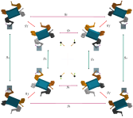
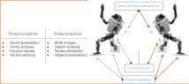
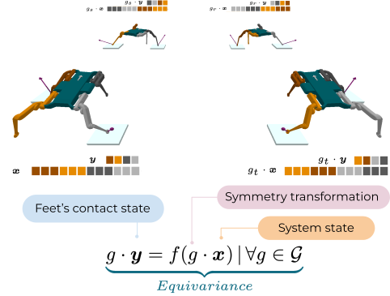
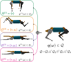
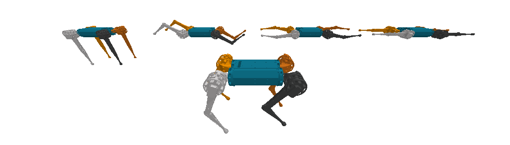
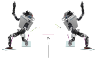
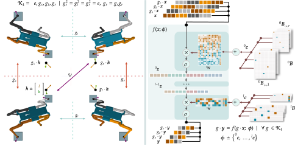

# Morphological Symmetries - _MorphoSymm_

The Morphological Symmetries (MorphoSymm) repository offers a comprehensive toolkit for the detection, analysis, and exploitation of morphological symmetries in the modeling and control of robotic systems. These symmetries are a common characteristic of both biological and artificial locomotion systems, including legged, swimming, and flying animals, robots, and virtual characters. Essentially, a morphological symmetry is a transformation that connects two equivalent states under the governing dynamics, meaning two states that will evolve identically when influenced by equivalent moving forces. For example, consider these two motion trajectories from the mini-cheetah quadruped robot, which are related by a symmetry transformation.

<p align="center">
  
</p>

These symmetries carry significant implications. Notably, they offer a valuable geometric bias, since by modeling and controlling the dynamics of one state, we can effectively identify and control the dynamics of all its symmetric counterparts (see [our paper](https://danfoa.github.io/MorphoSymm/) for details).


<p align="center">
  
</p>

## Group and representation theory

To exploit these symmetries, we employ the language of group and representation theory, enabling us to represent these transformations via linear algebra. The set of morphological symmetries of a robotic system forms the system's [discrete (or finite) symmetry group](https://en.wikipedia.org/wiki/Discrete_group). For example, the mini-cheetah robot's symmetry group $\mathbb{G}$ contains $8$ distinct transformations generated by combinations of the transformations $\{e, g_s, g_t, g_f\}$: 

<table border="0">
  <tr>
    <th align="center">
      
    </th>
    <th align="center">
      
    </th>
  </tr>
</table>

As depicted above, each symmetry transformation, represented by a group element $g \in \mathbb{G}$, influences the system's configuration and any proprioceptive and exteroceptive observations associated with the system's dynamic evolution. These observations include aspects such as joint torques, center of mass momentum, ground reaction forces, and terrain elevation/orientation. To numerically transform these observations, the appropriate group representation is required. This representation maps each symmetry transformation to an invertible matrix in the space where the observations resides. For example, to transform the robot's joint space generalized velocity coordinates $\mathbf{v}_ {js} \in \mathcal{T}_ {\mathbf{q}}\mathcal{Q}_ {js} \subset \mathbb{R}^{12}$, the group representation $\rho_ {\mathcal{T}_ {\mathbf{q}}\mathcal{Q}_ {js}}: \mathbb{G} \rightarrow \mathbb{GL}(\mathbb{R}^{12})$ is needed. This defines the symmetry transformations in the $12$ dimensional space in which $\mathbf{v}_ {js}$ evolves. In MorphoSymm, when you load a robotic system, you automatically receive its symmetry group and all the relevant group representations required to transform observations used in robotics. For our example, this appears as follows:

```python
from morpho_symm.utils.robot_utils import load_symmetric_system

robot, G = load_symmetric_system(robot_name='mini_cheetah')
# Get joint space position and velocity coordinates  (q_js, v_js) | q_js ∈ Qjs, dq_js ∈ TqQjs
_, v_js = robot.get_joint_space_state()

# Get the group representation on the space of joint space generalized velocity coordinates 
rep_TqQ_js = G.representations['TqQ_js']
for g in G.elements:
  # Transform the observations 
  g_v_js = rep_TqQ_js(g) @ v_js   # rep_TqQ_js(g) ∈ R^12x12
```

For more details follow the [getting started guide](#getting-started)

## Uses of morphological symmetries in robotics 
There are three use cases of morphological symmetries supported by MorphoSymm. For details and tutorials see the <a href="#getting-started">getting started guide</a>


<table border="0">
  <tr>
    <th colspan="2" align="center">Data Augmentation</th>
  </tr>
  <tr>
    <td align="left" width="400">
Any data recording of proprioceptive and exteroceptive observations can be augmented using the appropriate group representations. This means that if you collect data from a symmetric robotic system, you can use the system's symmetries to analitically augment/multiply the recorded data.
    </td>
    <td align="center">
      
    </td>
  </tr>
  <tr>
    <th colspan="2" align="center">Equivariant/Invariant Function Approximation</th>
  </tr>
  <tr>
    <td align="left" width="400">
Given the geometric nature of the data processed in robotics, most applications of machine learning to supervised, unsupervised, and reinforcement learning in robotics rely on the approximation of <a href="https://youtu.be/03MbWVlbefM?t=1393">equivariant/invariant functions</a>. To approximate these functions using deep learning, we should use equivariant/invariant neural networks that respect the symmetries of the learning problem. These networks feature enhanced sample efficiency and generalization, as demonstrated in our <a href="https://danfoa.github.io/MorphoSymm/">paper results</a>. This repository relies on pytorch and the <a href="https://quva-lab.github.io/escnn/">escnn</a> library to offer equivariant and invariant neural network architectures.  
    </td>
    <td align="center">
      
    </td>
  </tr>
  <tr>
    <th colspan="2" align="center">Dynamics Harmonics Analysis</th>
  </tr>
  <tr>
    <td align="left" width="400">
Through the application of abstract harmonic analysis, the symmetries of a robotic system enable us to decompose any motion into a superposition of simpler symmetric synergistic motions. Each of these motions evolves in a lower-dimensional space, known as an isotypic subspace. By projecting entire motion trajectories into these spaces, we can characterize each motion as a superposition of lower-dimensional and synergistic motions. For further details on the use of abstract harmonic analysis in robotics see our paper <a href="https://danfoa.github.io/DynamicsHarmonicsAnalysis/">Dynamics Harmonic Analysis of Robotic Systems: Application in Data-Driven Koopman Modeling</a>
    </td>
    <td align="center">
      
    </td>
  </tr>
  <tr>
    <td colspan="2" align="center">
      
    </td>
  </tr>
</table>

## Contents:
- [Installation](#installation)
- [Library of symmetric dynamical systems](#library-of-symmetric-dynamical-systems)
- [Getting Started](#getting-started)
    - [Loading symmetric dynamical systems](#loading-symmetric-dynamical-systems)
    - [Available group representations](#available-group-representations)
    - [Data-Augmentation](#data-augmentation)
    - [Equivariant/Invariant Neural Networks](#equivariantinvariant-neural-networks)
- [How to cite us?](#how-to-cite-us)
- [Contributing](#contributing)

## Installation:
Simply clone the repository and install it through pip:
```bash
git clone https://github.com/Danfoa/MorphoSymm.git
cd MorphoSymm
pip install -e .
```

## Library of symmetric dynamical systems
The following is a non-exhaustive and expanding list of dynamical systems with Discrete Morphological Symmetries. Each example can be
reproduced in a 3D interactive environment running:
```python
python morpho_symm/robot_symmetry_visualization.py robot=<robot> gui=True 
```
This script functions as an introductory tutorial showing how we define the representations of Discrete Morphological Symmetries in order to perform symmetry transformations on the robot state, and proprioceptive and exteroceptive observations.
### $\mathbb{G}=\mathbb{C}_2$: Reflection Symmetry

<table border="0">
  <tr>
    <th align="center"> Cassie </th>
    <th align="center"> Atlas </th>
    <th align="center"> KUKA-iiwa </th>
    <th align="center"> Mini-Cheetah </th>
    <th align="center"> Bolt </th>
    <th align="center"> Baxter </th>
    <th align="center"> Solo </th>
    <th align="center"> A1 </th>
    <th align="center"> HyQ </th>
    <th align="center"> Anymal-C </th>
    <th align="center"> Anymal-B </th>
    <th align="center"> Go1 </th>
    <th align="center"> B1 </th>
    <th align="center"> UR-3 </th>
    <th align="center"> UR-5 </th>
    <th align="center"> UR-10 </th>
  </tr>
  <tr>
    <td align="center">
      
    </td>
    <td align="center">
      
    </td>
    <td align="center">
      
    </td>
    <td align="center">
      
    </td>
    <td align="center">
       
    </td>
    <td align="center">
      
    </td>
    <td align="center">
      
    </td>
    <td align="center">
      
    </td>
    <td align="center">
      
    </td>
    <td align="center">
      
    </td>
    <td align="center">
      
    </td>
    <td align="center">
      
    </td>
    <td align="center">
      
    </td>
    <td align="center">
      
    </td>
    <td align="center">
      
    </td>
    <td align="center">
      
    </td>
  </tr>
</table>

### $\mathbb{G}=\mathbb{C}_n$: Cyclic group symmetries

<table>
  <tr>
    <th align="center">Trifinger</th>
  </tr>
  <tr>
    <td align="center">
      
    </td>
  </tr>
</table>

### $\mathbb{G}=\mathbb{K}_4$: Klein-Four Symmetry

<table>
  <tr>
    <th align="center">Solo</th>
    <th align="center">HyQ</th>
    <th align="center">Mini-Cheetah</th>
    <th align="center">Anymal-C</th>
    <th align="center">Anymal-B</th>
  </tr>
  <tr>
    <td align="center">
      
    </td>
    <td align="center">
      
    </td>
    <td align="center">
      
    </td>
    <td align="center">
      
    </td>
    <td align="center">
      
    </td>
  <tr>
</table>

### $\mathbb{G}=\mathbb{C}_2\times\mathbb{C}_2\times\mathbb{C}_2$: Regular cube symmetry

<table>
  <tr>
    <th align="center">Solo</th>
    <th align="center">Mini-Cheetah</th>
  </tr>
  <tr>
    <td align="center">
      
    </td>
    <td align="center">
      
    </td>
  </tr>
</table>

### Addition of new dynamical systems to the library.

If you want a new robot to be introduced in the library create an issue request indicating where to find the URDF of the system.
___________________________________________
## Getting Started 

### Loading symmetric dynamical systems
Each symmetric dynamical system has a configuration file in the folder `morpho_symm/cfg/supervised/robot`. To load one
of these systems, simply use the function `load_symmetric_system` as follows:

```python
from morpho_symm.utils.robot_utils import load_symmetric_system
robot_name = 'solo'  # or any of the robots in the library (see `/morpho_symm/cfg/robot`)

robot, G = load_symmetric_system(robot_name=robot_name)
```

The function returns:
- `robot` an instance of the class [`PinBulletWrapper`](https://github.com/Danfoa/MorphoSymm/blob/devel/morpho_symm/robots/PinBulletWrapper.py) (utility class bridging [`pybullet`](https://pybullet.org/wordpress/) and [`pinocchio`](https://github.com/stack-of-tasks/pinocchio)).
-  `G`: the symmetry group of the system of instance [`escnn.group.Group`](https://quva-lab.github.io/escnn/api/escnn.group.html#group)
  
### Getting and resetting the state of the system

The system state is defined as $(\mathbf{q}, \mathbf{v}) | \mathbf{q} \in \mathcal{Q},  \mathbf{v} \in T_{q}\mathcal{Q}$, being $\mathcal{Q}$ the space of generalized position coordinates, and $\mathcal{T}_ {q}\mathcal{Q}$ the space of generalized velocity coordinates. Recall from the [paper convention](https://arxiv.org/abs/2302.10433) that the state configuration can be separated into base configuration and joint space configuration $\mathcal{Q} := \mathbb{E}_ d \times \mathcal{Q}_ {js}$. Where, $\mathbb{E}_ d$ is the Euclidean space in which the system evolves, and $\mathcal{Q}_ {js}$ is the joint space position coordinates. This enables to express every system state as $\mathbf{q} := \[\mathbf{X}_ B,  \mathbf{q}_ {js}\]^ T$, where $\mathbf{X}_ B \in  \mathbb{E}_ d$ and $\mathbf{q}_ {js} \in \mathcal{Q}_ {js}$. To access these quantities in code we do:
```python 
# Get the state of the system
q, v = robot.get_state()  #  q ∈ Q, v ∈ TqQ
# Get the robot's base configuration XB ∈ Ed as a homogenous transformation matrix.
XB = robot.get_base_configuration()
# Get joint space position and velocity coordinates  (q_js, v_js) | q_js ∈ Qjs, dq_js ∈ TqQjs
q_js, v_js = robot.get_joint_space_state()
```

### Available group representations
  
The system's symmetry group instance `G` contains the group representations required to transform most proprioceptive and exteroceptive observations (e.g., joint positions/velocities/accelerations, joint forces/torques, contact locations & forces, linear and angular velocities, terrain heightmaps, depthmaps, etc). These are:


 -  $\rho_ {\mathbb{E}_d}: \mathbb{G} \rightarrow \mathbb{E}_d$: Representation mapping symmetry actions to elements of the Euclidean group $\mathbb{E}_d$. Essentially, **homogenous transformation matrices** describing a rotation/reflection and translation of space (Euclidean isometry) in $d$ dimensions.
 <!-- -   -->
 -  $\rho_ {\mathcal{Q}_ {js}}: \mathbb{G} \rightarrow \mathcal{GL}(\mathcal{Q}_ {js})$ and $\rho_ {\mathcal{T}_ {q}\mathcal{Q}_ {js}}: \mathbb{G} \rightarrow \mathcal{GL}(\mathcal{T}_ {q}\mathcal{Q}_ {js})$: Representations mapping symmetry actions to transformation matrices of joint space position $\mathcal{Q}_ {js}$ and velocity $T_{q}\mathcal{Q}_ {js}$ coordinates. 
 <!-- -  -->
 -  $\rho_ {\mathbb{R}^d}: \mathbb{G} \rightarrow \mathcal{GL}(\mathcal{\mathbb{R}^d})$: Representation mapping symmetry actions to elements to invertible transformations in $d$ dimensions. In practise, **rotation** and **reflection** matrices .
 <!-- -   -->
 -  $\rho_ {reg}: \mathbb{G} \rightarrow \mathbb{R}^{|\mathbb{G}|}$: The group regular representation.
 <!-- -   -->
 -  $\hat{\rho}_ {i}: \mathbb{G} \rightarrow \mathcal{GL}(|\hat{\rho}_ {i}|)$: Each of the group irreducible representations.

In practice, direct products and direct sums (block-diagonal stacking) of these representations are enough to obtain the representations of any proprioceptive and exteroceptive measurements/observations. That is, these representations are sufficient to perform [data-augmentation](#data-augmentation) and to construct [equivariant/invariant neural networks](#equivariantinvariant-neural-networks). 

### Data-Augmentation 

Here, we provide some basic examples of augmenting observations frequently used in robotics, such as the configuration of a rigid-body, the joint space position, velocity, and accelerations, contact forces, joint torques, etc. To gain intiution, focus on the simplest symmetry group, the relfection group $\mathbb{C}_ 2 = \\{e, g_s\\}$, characteristic of the symmetries of a bipedal system:
<table border="0">
  <tr>
    <th align="center">
      
    </th>
    <th align="center">
      
    </th>
  </tr>
</table>

Any observation from this robot has a symmetric equivalent observation. In this tutorial we will show how to obtain these symmetric observations. You can also check the script [robot_symmetry_visualization.py](https://github.com/Danfoa/MorphoSymm/blob/devel/morpho_symm/robot_symmetry_visualization.py), where we use data-augmentation to generate the animation displayed above. This script works for any robot in the library.

#### Observations evolving in the Euclidean group of $d$ dimensions $\mathbb{E}_d$.
  
The homogenous matrix describing the configuration of any rigid body, including the system's base configuration $\mathbf{X}_ B$ is an observation evolving in $\mathbb{E}_ d$. To obtain the set of symmetric base configurations, i.e. the observation group orbit: $\mathbb{G} \cdot \mathbf{X}_ B = \\{g \cdot \mathbf{X}_ B := \rho_ {\mathbb{E}_ d}(g) \\; \mathbf{X}_ B \\; \rho_ {\mathbb{E}_ d}(g)^{-1} | \forall \\; g \in \mathbb{G}\\}$ [(1)](https://danfoa.github.io/MorphoSymm/), you can do the following:

```python 
rep_Ed = G.representations['Ed']  # rep_Ed(g) ∈ R^(d+1)x(d+1) is a homogenous transformation matrix 
# The orbit of the base configuration XB is a map from group elements g ∈ G to base configurations g·XB ∈ Ed
orbit_X_B = {g: rep_Ed(g) @ XB @ rep_Ed(g).T for g in G.elements()} 
```

Another example of an observation transfromed by $\rho_ {\mathbb{E}_ d}$ are **points** in $\mathbb{R}^d$. These can represent contact locations, object/body positions, etc. To obtain the point orbit, $\mathbb{G} \cdot \mathbf{r} = \\{g \cdot \mathbf{r} := \rho_ {\mathbb{E}_ d}(g) \\; \mathbf{r} | \forall \\; g \in \mathbb{G} \\}$, you can do:
```python
r = np.random.rand(3)   # Example point in Ed, assuming d=3.
r_hom = np.concatenate((r, np.ones(1)))  # Use homogenous coordinates to represent a point in Ed
# The orbit of the point is a map from group elements g ∈ G to the set of symmetric points g·r ∈ R^d
orbit_r = {g: (rep_Ed(g) @ r_hom)[:3] for g in G.elements}
```

#### Observations evolving in Joint Space (e.g. joint positions, velocity, torques). 

Joint space observations usually evolve in the space of generalized position $\mathcal{Q}_ {js}$ and velocity $T_{q}\mathcal{Q}_ {js}$ generalized coordinates. These include joints position, velocity, acceleration, and generalized forces/torques. In this example we will transfrom the joint space state, composed of the joint position and velocity coordinates  $(\mathbf{q}_ {js}, \mathbf{v}_ {js}) \\; | \\; \mathbf{q}_ {js} \in \mathcal{Q}_ {js}, \mathbf{v}_ {js} \in \mathcal{T}_ {q}\mathcal{Q}_ {js}
$, using the representations $\rho_ {\mathcal{Q}_ {js}}$ and $\rho_ {\mathcal{T}_ {q}\mathcal{Q}_ {js}}$. To obtain the orbit of the joint space state in code you can do:
```python
rep_Qjs = G.representations['Q_js']     
rep_TqQjs = G.representations['TqQ_js']
# Get joint space position and velocity coordinates  (q_js, v_js) | q_js ∈ Qjs, dq_js ∈ TqQjs
q_js, v_js = robot.get_joint_space_state()
# The joint space state orbit is a map from group elements g ∈ G to joint space states (g·q_js, g·v_js)  
orbit_js_state = {g: (rep_Qjs(g) @ q_js, rep_TqQjs(g) @ v_js) for g in G.elements}
```

#### Obervations evolving $\mathbb{R}_ d$ (e.g. vectors, pseudo-vectors).

Observations evolving in $\mathbb{R}_ d$ include contact and ground reaction forces, linear and angular velocity of rigid bodies, distance vectors to target positons/locations, etc. To tranform vectors we use the representation $\rho_ {\mathbb{R}_ {d}}$. While to transform [pseudo-vectors](https://en.wikipedia.org/wiki/Pseudovector#:~:text=In%20physics%20and%20mathematics%2C%20a,of%20the%20space%20is%20changed) (or axial-vectors) we use the representation $\rho_ {\mathbb{R}_ {d,pseudo}}$ (these can represent angular velocities, angular accelerations, etc.). To obtain the orbit of these observations you can do:
```python
rep_Rd = G.representations['Rd'] # rep_Rd(g) is an orthogonal matrix ∈ R^dxd
rep_Rd_pseudo = G.representations['Rd_pseudo'] 

v = np.random.rand(3)  # Example vector in R3, E.g. linear velocity of the base frame.
w = np.random.rand(3)  # Example pseudo-vector in Ed, assuming d=3. E.g. angular velocity of the base frame.
# The orbit of the vector is a map from group elements g ∈ G to the set of symmetric vectors g·v ∈ R^d
orbit_v = {g: rep_Rd(g) @ v for g in G.elements}
# The orbit of the pseudo-vector is a map from group elements g ∈ G to the set of symmetric pseudo-vectors g·w ∈ R^d
orbit_w = {g: rep_Rd_pseudo(g) @ w for g in G.elements}
```

### Equivariant/Invariant Neural Networks

In robotics, any data-driven application of supervised, unsupervised, and reinforcement learning involves approximating a function. This function maps a set of proprioceptive/exteroceptive observations (e.g., system state, contact state, contact points/forces) to an output set of similar observations (e.g., control position/torque setpoints, linear/angular velocity vector, energy). If the robotic system possesses a symmetry group $\mathbb{G}$, these observations will also feature a symmetry group, making the target function either [$\mathbb{G}$-equivariant or $\mathbb{G}$-invariant](https://youtu.be/03MbWVlbefM?t=1393). In this brief tutorial we will show you how to construct a $\mathbb{G}$-equivariant and a $\mathbb{G}$-invariant neural network to approximate these functions from data.


#### $\mathbb{G}$-equivariant$ neural network
Let's consider the example from [(1)](https://arxiv.org/abs/2302.1043) of approximating the Center of Mass (CoM) momentum from the joint space state observations. That is we want to use a neural network to approximate the function $\mathbf{y} = f(\mathbf{x}) = f(\mathbf{q}_ {js}, \mathbf{v}_ {js})$ for a robot evolving in 3 dimensions, say the robot `solo`. Defining $\mathbf{y} := [\mathbf{l}, \mathbf{k}]^T \subseteq \mathbb{R}^6$ as the CoM momentum linear $\mathbf{l} \in \mathbb{R}^3$ and angular $\mathbf{k} \in \mathbb{R}^3$ momentum, and $\mathbf{x} = (\mathbf{q}_ {js}, \mathbf{v}_ {js}) \\; |  \\; \mathbf{q}_ {js} \in \mathcal{Q}_ {js}, \mathbf{v}_ {js} \in \mathcal{T}_ {q}\mathcal{Q}_ {js}$ as the joint space position and velocity generalized coordinates.

<table>
  <tr>
    <td align="center">
      
    </td>
    <td align="center">
      
    </td>
  </tr>
</table>

To construct a G-equivariant architecture you need to:
1. Identify the representations of the observations in your input and output spaces.
2. Define the input and output [`FieldType`](https://quva-lab.github.io/escnn/api/escnn.nn.html#field-type) instances using the representations of each geometric object.
3. Instanciate a [EMLP](https://github.com/Danfoa/MorphoSymm/blob/fc42a19654a9385b1037d1a2678aa95829a47a06/morpho_symm/nn/EMLP.py#L14) architecture with the input and output `FieldType` instances. This class handles the appropiate parametrization of the hidden layer group representations and activation functions.

```python
import numpy as np
import escnn
from escnn.nn import FieldType
from hydra import compose, initialize

from morpho_symm.nn.EMLP import EMLP
from morpho_symm.utils.robot_utils import load_symmetric_system

# Load robot instance and its symmetry group
robot, G = load_symmetric_system(robot_name='solo-k4')

# We use ESCNN to handle the group/representation-theoretic concepts and for the construction of equivariant neural networks.
gspace = escnn.gspaces.no_base_space(G)
# Get the relevant group representations.
rep_Qjs = G.representations["Q_js"]  # Used to transform joint space position coordinates q_js ∈ Q_js
rep_TqQjs = G.representations["TqQ_js"]  # Used to transform joint space velocity coordinates v_js ∈ TqQ_js
rep_R3 = G.representations["Rd"]  # Used to transform the linear momentum l ∈ R3
rep_R3_pseudo = G.representations["Rd_pseudo"]  # Used to transform the angular momentum k ∈ R3

# Define the input and output FieldTypes using the representations of each geometric object.
# Representation of x := [q_js, v_js] ∈ Q_js x TqQ_js =>  ρ_X_js(g) := ρ_Q_js(g) ⊕ ρ_TqQ_js(g)  | g ∈ G
in_field_type = FieldType(gspace, [rep_Qjs, rep_TqQjs])
# Representation of y := [l, k] ∈ R3 x R3            =>    ρ_Y_js(g) := ρ_R3(g) ⊕ ρ_R3pseudo(g)  | g ∈ G
out_field_type = FieldType(gspace, [rep_R3, rep_R3_pseudo])

# Construct the equivariant MLP
model = EMLP(in_type=in_field_type,
             out_type=out_field_type,
             num_layers=5,              # Input layer + 3 hidden layers + output/head layer
             num_hidden_units=128,      # Number of hidden units per layer
             activation=escnn.nn.ReLU,  # Activarions must be `EquivariantModules` instances
             with_bias=True             # Use bias in the linear layers
             )

print(f"Here is your equivariant MLP \n {model}")
```

## How to cite us?
If you find this repository or any our our papers relevant please cite us as:

### [On discrete symmetries of robotics systems: A group-theoretic and data-driven analysis](https://danfoa.github.io/MorphoSymm/)
```
@INPROCEEDINGS{Ordonez-Apraez-RSS-23,
    AUTHOR    = {Daniel F Ordo{\~n}ez-Apraez AND Martin, Mario AND Antonio Agudo AND Francesc Moreno},
    TITLE     = {{On discrete symmetries of robotics systems: A group-theoretic and data-driven analysis}},
    BOOKTITLE = {Proceedings of Robotics: Science and Systems},
    YEAR      = {2023},
    ADDRESS   = {Daegu, Republic of Korea},
    MONTH     = {July},
    DOI       = {10.15607/RSS.2023.XIX.053}
}
```
### [Dynamics Harmonic Analysis of Robotic Systems: Application in Data-Driven Koopman Modeling](https://danfoa.github.io/DynamicsHarmonicsAnalysis/)

```
@article{ordonez2023dynamics,
  title={Dynamics Harmonic Analysis of Robotic Systems: Application in Data-Driven Koopman Modelling},
  author={Ordo{\~n}ez-Apraez, Daniel and Kostic, Vladimir and Turrisi, Giulio and Novelli, Pietro and Mastalli, Carlos and Semini, Claudio and Pontil, Massimiliano},
  journal={arXiv preprint arXiv:2312.07457},
  year={2023}
}
```

## Contributing

If you have any doubts or ideas, create an issue or contact us. We are happy to help and collaborate.

In case you want to contribute, thanks for being that awesome, and please contact us to see how can we assist you.

#### Robotics
The repository focuses on robotics and uses the URDF (Unified Robot Description Format) to integrate new systems.
It utilizes the [robot_descriptions.py](https://github.com/robot-descriptions/robot_descriptions.py) package to simplify the integration of new URDF descriptions and their usage in
third-party robotics packages. This package provides a convenient interface for loading URDF files into GUI
visualization tools, robot dynamics packages (such as Pinocchio), and physics simulators. To add a new robotic system to our library
1. The system URDF must be contributed to robot_descriptions.py.
2. The corresponding robot configuration file should be added to `cfg/supervised/robot/` describing the system' symmetry group and joint space representation generators, should also be added.

In summary, we support:

- [x] Loading of URDF files in `pybullet` and `pinocchio` through `robot_descriptions.py`
- [x] Visualization of robot Discrete Morphological Symmetries in `pybullet`. Other physics simulators and visualization tools will come soon.
- [x] Utility functions to define symmetry representations of proprioceptive and exteroceptive observations.
- [x] Construction of equivariant neural networks processing proprioceptive and exteroceptive observations, using the `escnn` library.
- [x] Use abstract harmonic analysis to decompose motion trajectories and recorded proprioceptive and exteroceptive observations into isotypic components. 

