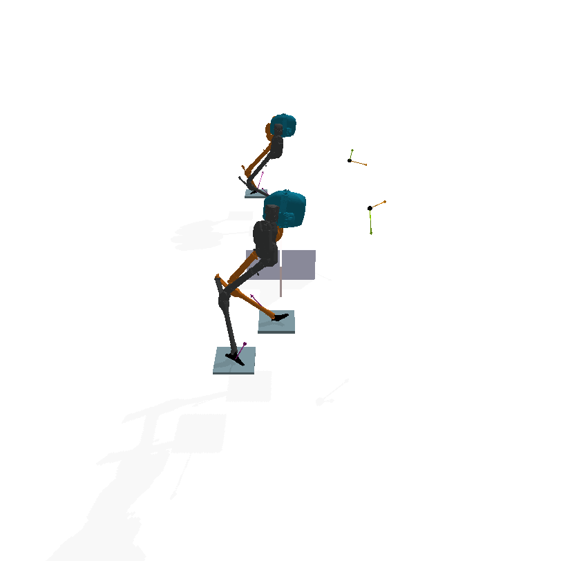
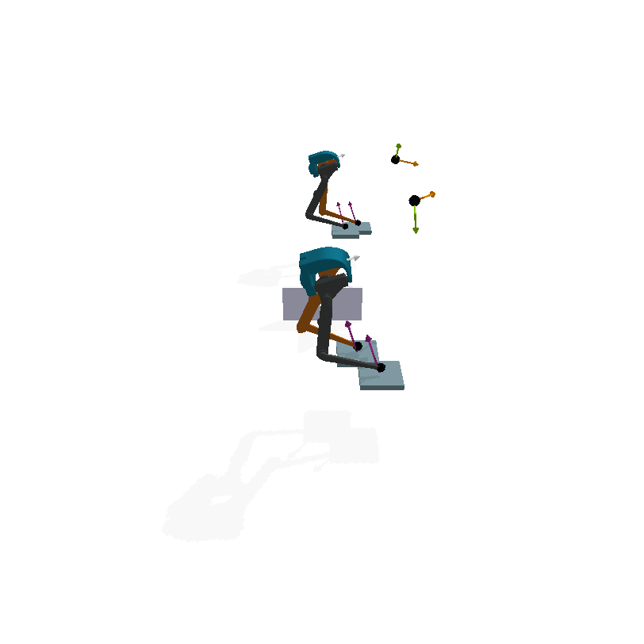
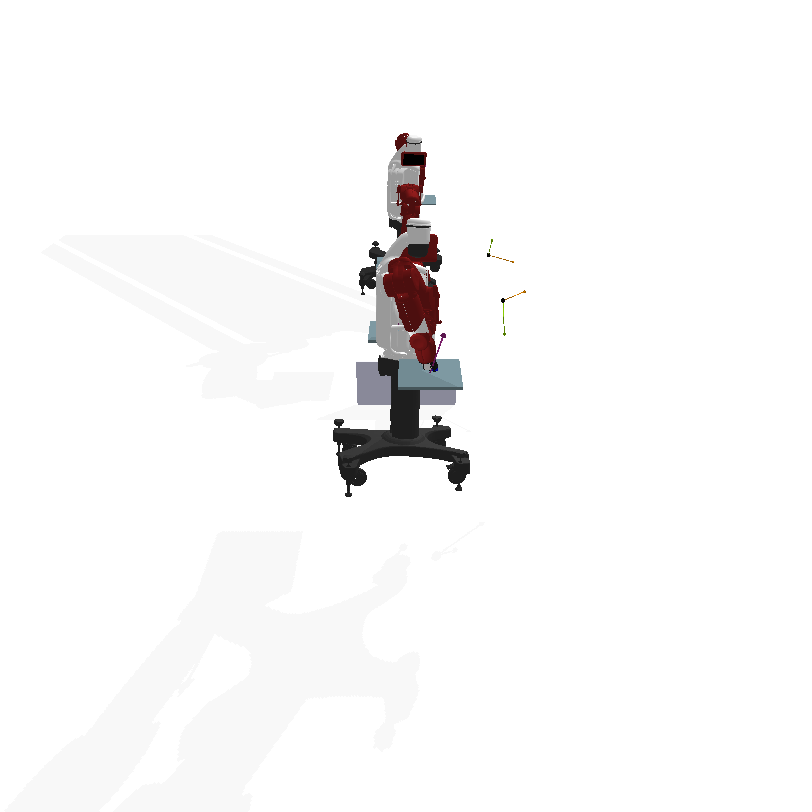
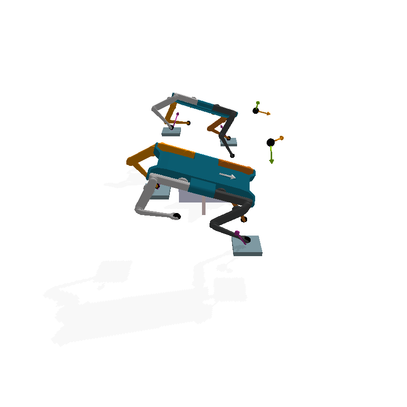
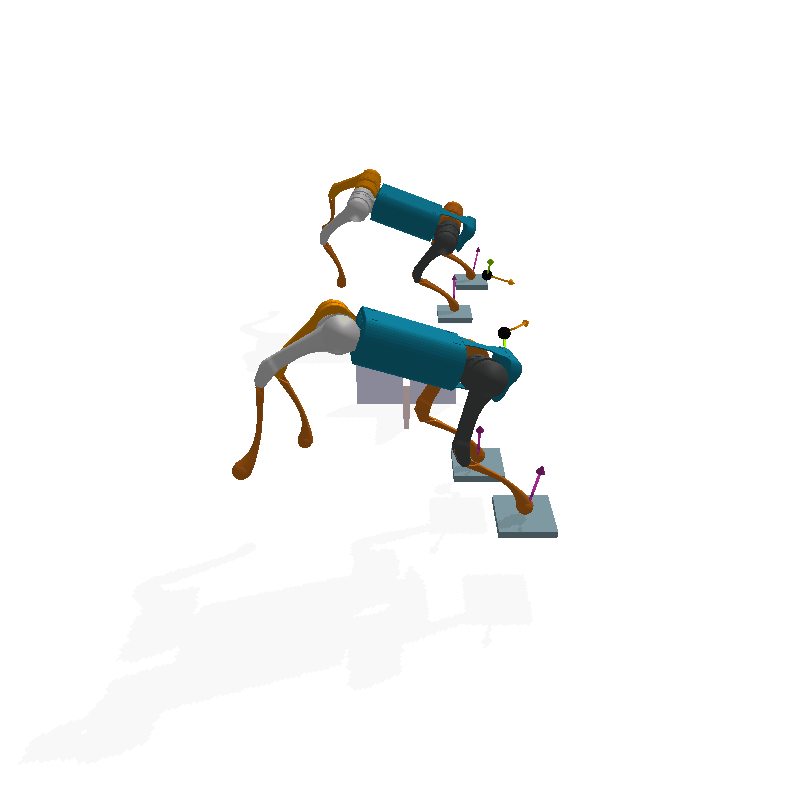
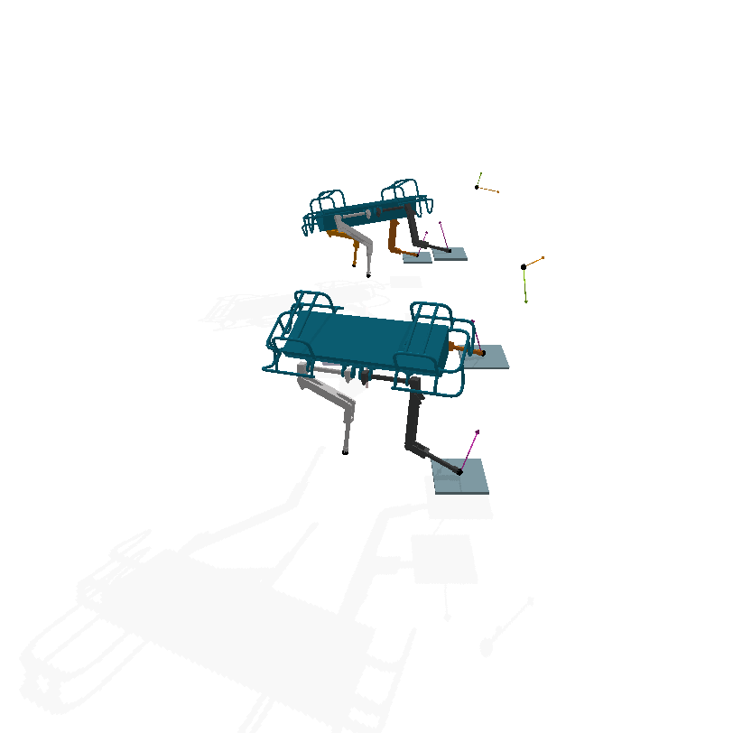
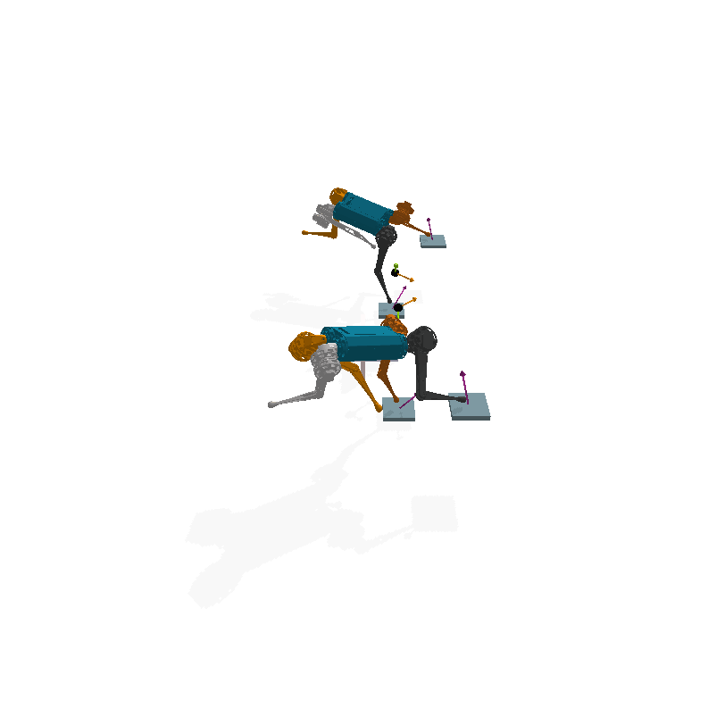
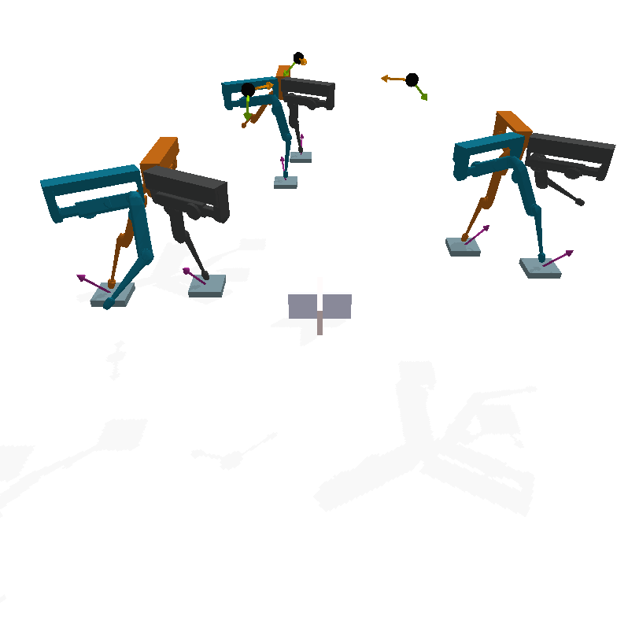
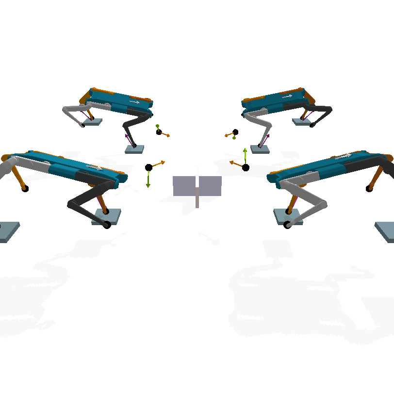
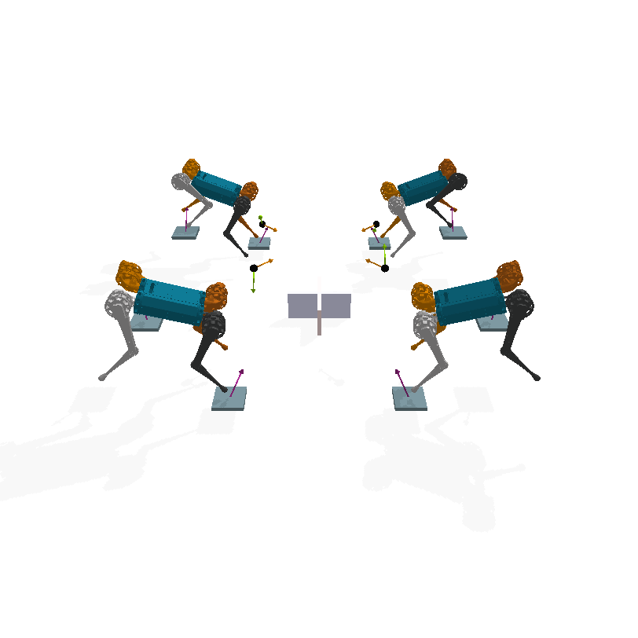

# Morphological Symmetries (MorphoSymm) in Locomoting Dynamical Systems


Welcome to the Morphological Symmetries (MorphoSymm) repository! Here, you will find a comprehensive set of tools for the identification, study, and exploitation of morphological symmetries in locomoting dynamical systems. These symmetries are commonly found in a wide range of systems, including legged, swimming, and flying animals, robotic systems, and animated characters. As such, this repository aims to provide valuable resources for researchers and practitioners in the fields of Robotics, Computer Graphics, and Computational Biology.


This repository holds the code for the paper: [On discrete symmetries of robotic systems: A data-driven and group-theoretic analysis](https://scholar.google.it/scholar?q=on+discrete+symmetries+of+robotic+systems:+a+data-driven+and+group-theoretic+analysis&hl=en&as_sdt=0&as_vis=1&oi=scholart). 
Accepted to Robotics Science and Systems 2023 (RSS 2023). For reproducing the experiments of the paper, please see the master branch.
### Installation:
Simply clone the repository and install throuhg pip:
```
git clone https://github.com/Danfoa/MorphoSymm.git
cd MorphoSymm
pip install -e .
```
## Library of dynamical systems with Discrete Morphological Symmetries 
The following is a non-exhaustive and expanding list of dynamical systems with Discrete Morphological Symmetries. Each example can be
reproduced in a 3D interactive environment running:
```
cd [...]/MorphoSymm
python morpho_symm.robot_symmetry_visualization.py robot=<robot> gui=True 
```
This script functions as an introductory tutorial showing how we define the representations of Discrete Morphological Symmetries in order to perform symmetry transformations on the robot state, and proprioceptive and exteroceptive measurements.
### $\mathcal{G}=\mathcal{C}_2$: Reflection Symmetry
|                                         Cassie                                          |                                                                Atlas   	                                                                |                                      Bolt   	                                       |                                                                                    Baxter 	                                                                                     |   
|:---------------------------------------------------------------------------------------:|:---------------------------------------------------------------------------------------------------------------------------------------:|:-----------------------------------------------------------------------------------:|:-------------------------------------------------------------------------------------------------------------------------------------------------------------------------------:|
|  | 	  |  |                                                                                          | 	        
 |      [Solo](https://open-dynamic-robot-initiative.github.io/)  	                	       |                                                               **A1**   	                                                                |                                     **HyQ**  	                                      |                                                                                  Mini-Cheetah	                                                                                  |   
|      |                                                          |   |                                                                                      |

### $\mathcal{G}=\mathcal{C}_n$: Symmetric Systems with Cyclic Group Symmetries 
|       [Trifinger](https://sites.google.com/view/trifinger/home-page)-C3 	       |   
|:-------------------------------------------------------------------------------:|
| 	 | 	        

### $\mathcal{G}=\mathcal{K}_4$: Klein-Four Symmetry
| [Solo](https://open-dynamic-robot-initiative.github.io/)|                                          HyQ 	                                          |                                      Mini-Cheetah-K4                                       |
|:---------------------------------------------------------------------------------------------------------------:|:---------------------------------------------------------------------------------------:|:------------------------------------------------------------------------------------------:|
|                      	                       | 	  | 	       |  

### $\mathcal{G}=\mathcal{C}_2\times\mathcal{C}_2\times\mathcal{C}_2$: Regular cube symmetry 
|                              [Solo](https://open-dynamic-robot-initiative.github.io/) 	                              |                                         Mini-Cheetah                                          |
|:--------------------------------------------------------------------------------------------------------------------:|:---------------------------------------------------------------------------------------------:|
|                     	                     | 	    |      

### Addition of new dynamical systems to the library.

This repository aims at becoming a central tool in the exploitation of Morphological Symmetries in Robotics, Computer Graphics and Computational Biology.
Therefore, here we summarize the present and future efforts to enlarge the library of dynamical systems used in each of these fields.

#### Robotics
The repository focuses on robotics and uses the URDF (Unified Robot Description Format) to integrate new systems. 
It utilizes the [robot_descriptions.py](https://github.com/robot-descriptions/robot_descriptions.py) package to simplify the integration of new URDF descriptions and their usage in 
third-party robotics packages. This package provides a convenient interface for loading URDF files into GUI 
visualization tools, robot dynamics packages (such as Pinocchio), and physics simulators. To add a new robotic system to our library
1. The system URDF must be contributed to robot_descriptions.py.
2. The corresponding robot configuration file should be added to `cfg/supervised/robot/` describing the system' symmetry group and joint-space representation generators, should also be added.

In summary, we support:

- [x] Loading of URDF files in `pybullet` and `pinocchio` through `robot_descriptions.py` 
- [x] Visualization of robot Discrete Morphological Symmetries in `pybullet`. Other physics simulators and visualization tools will come soon. 
- [x] Utility functions to define symmetry representations of proprioceptive and exteroceptive measurements.

#### Computer Graphics

The field of computer graphics do not widely employs URDF descriptions for the definition of dynamical systems. Although, covering different description standards is within the goal of this repository, 
for now our main objective is:

- [ ] Integration of [STAR](https://star.is.tue.mpg.de/) model in the library, to automatically process sequence of data and obtain symmetric sequences. 
By defining the sagittal symmetry of all the model parameters. This will enable the use of DMSs in all applications of human motion prediction, shape reconstruction, etc. 
If you are interested in contributing to this effort, please contact us.
- [ ] Integration of Motion Capture (MoCap) data formats. Including `.fbx`, `.bvh`, and `.c3d`. 

#### Computational Biology

For computational biology and bio-mechanics, we believe the most relevant format to provide support for is:
- [ ] Coordinate 3D files `.c3d` format. 

## How to cite us?
If you find this repository or the [paper](https://scholar.google.it/scholar?q=on+discrete+symmetries+of+robotic+systems:+a+data-driven+and+group-theoretic+analysis&hl=en&as_sdt=0&as_vis=1&oi=scholart) useful, please cite us as:
```
@article{ordonez2023dms_discrete_morphological_symmetries,
  title={On discrete symmetries of robotics systems: A group-theoretic and data-driven analysis},
  author={Ordonez-Apraez, Daniel and Martin, Mario and Agudo, Antonio and Moreno-Noguer, Francesc},
  journal={arXiv preprint arXiv:2302.10433},
  year={2023}
}
```

## Construction of $\mathcal{G}$-Equivariant Neural Networks

We are currently transitioning to use the package [ESCNN](https://github.com/QUVA-Lab/escnn) for the construction of 
equivariant function approximators exploiting morphological symmetries. This is an ongoing effort. However, on the master branch 
you can build large-scale equivariant MLP or CNNs using the `nn/EquivariantModules.py` module. Where you can find the $\mathcal{G}$-Equivariant Perceptron (`BasisLinear`) and Convolutional (`BasisConv1d`) layers classes. 
These are the equivariant versions of the standard Pytorch `Linear` and `Conv1D` layers. 

The parametrization of the equivariant layers (i.e., class signature) is identical to the unconstrained Pytorch layer classes.
The only additional parameters are the input output representations `rep_in` and `rep_out`. 
Each representation class instance holds the Symmetry Group and the matrix representations of each of the group actions.

Each example of the library of equivariant dynamical systems holds the representations on the Euclidean Space `Ed` and 
on the system join-space `Q_J`, required to construct the representation for any NN input output spaces.

Expect a tutorial for the use of these classes. For now, visit `nn/ContactCNN` and `nn/EMLP` for the classes of the 
NN architectures used in the experiments of the paper.

## Contributing

If you have any doubts or ideas, create an issue or contact us. We are happy to help and collaborate.

In case you want to contribute, thanks for being that awesome, and please contact us to see in what can we assist you. 